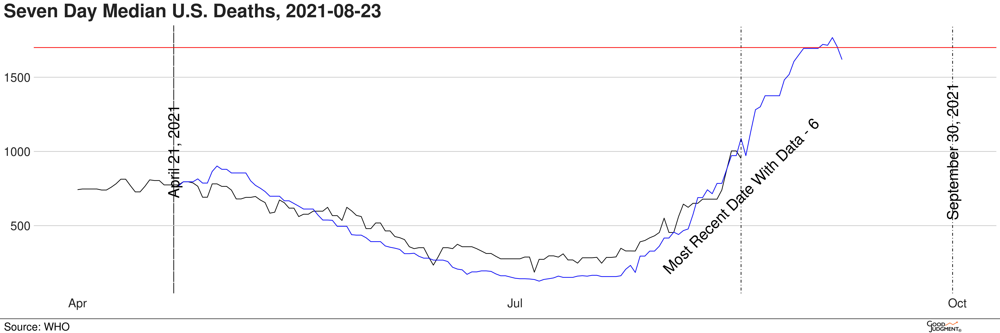

# Description

Forecasting is a repository of R scripts useful for geopolitical forecasting.

# Quick Introduction

Why and how would you use this respository? Let's imagine you were
trying to forecast this question on GJOpen:

*Question: What will be the US producer price index for Internet
advertising sales in June 2022?*[1]

*Possible Answers*
1. Lower than 60.0
2. Between 60.0 and 66.0
3. Higher than 66.0 but lower than 72.0
4. Between 72.0 and 78.0, inclusive 	
5. Higher than 78.0 but lower than 84.0 	
6. 84.0 or higher 	

Most people try to answer this question by taking a look at the
underlying data, factoring in what they know about the world, and
making a guess. R Script enables you to get greater precision on
what the probabilities are based on the underlying data.

In this case, it is easy to make a forecast. This data is in
FRED.[2] There is a script, written as a function, that will allow
you to enter the following into a script to generate
probabilities:

```
    # GJO: What will be the US producer price index for Internet advertising sales in June 2022?
    source("fred.R")
       fred(code="WPU365",
            begin_date="2010-01-01", # For analysis, not question
            closing_date="2022-06-01",
            bins=c(60, 66, 72, 78, 84, Inf),
            prob_type="historical")
```

So, the first line calls the script. The second begins the
function call, the rest of the elements are self explanatory,
except for prob_type, which are different ways to generate
probabilties. Historical can generate simple historical
comparisons over the same interval as the forecast period, and it
will generate a table like this one:

```
0.  bins probs
1.   60 0.074
2.   66 0.247
3.   72 0.347
4.   78 0.228
5.   84 0.083
6.  Inf 0.020
```

It takes less than a minute to run. You could also do bulk
updates, where you put all your updates into one R script and call
them all in the same time. Some people have even automated the
process, so scripts automatically update their forecasts on a
forecasting site. Personally, I don't think that is necessary. It
already shortens the time considerably, and you still have to make
some judgment calls on these probabilities based on what you know
is going on in this world. 

For example, at the time of this writing, the Delta variant of
COVID-19 is causing surges of infections, and presumable this will
reduce the probabilties. You might also want to compare the
historical probabilities against a Monte Carlo simulation (also
available in this repository, just change the probability type
above to prob_type="monte-full"),

As you can imagine, this can be a very powerful tool that can help
improve your forecasts considerably.

# Learning R Script

I first heard of using R Script from a "superforecaster" who was
automating his forecasts at the end of 2018. I had dabbled in a
few programming languages, but I was not a programmer. I used the
examples this person gave me, and I worked very hard on one script
(flu.R) to understand how to do things in R. As I used it to
generate probabilities, make graphs, and so forth, it gets
easier. There are a lot of libraries that you can use to access
and manipulate data. Together they provide an excellent tool.

Imagine trying to forecast the progression of COVID-19 deaths due
to the Delta variant. Then, consider the chart below:



The black line is 7-day median deaths. The blue line is new cases,
scaled to 1% and brought forward 21 days. the red line is the
threshold for the question. If you only were looking at past death
data, you'd know it was going up, but you wouldn't know by how
much. Putting this chart together makes the answer obvious. Doing
charts like these is easy to do, as you can tell when you look in
this respository. Here's the relevant code:

```
      plot <- ggplot() +     
	    geom_line(data = df, aes(x = date, y = deaths)) +     
	    geom_line(data = df, aes(x = date+21, y = cases), colour = "blue") +     
	    geom_vline(xintercept=start_date, linetype="F1", colour="black") +     
	    geom_text(aes(x=start_date, label="April 21, 2021", y=1000, angle=90), size=8) +
        geom_vline(xintercept=as.numeric(as.Date(last_data_date-6)), linetype=4, colour="black") +
        geom_text(aes(x=last_data_date-6, label="Most Recent Date With Data - 6 Days", y=700, angle=45), size=8) +
        geom_vline(xintercept=as.numeric(as.Date(end_date)), linetype="F1", colour="black") +     
	    geom_text(aes(x=end_date, label="September 30, 2021", y=1000, angle=90), size=8) +     
	    geom_hline(yintercept=1700, color="red") +     
	    # geom_hline(yintercept=1000, color="yellow") +     
	    # geom_hline(yintercept=1300, color="green") +     
	    bbc_style() +     
	    labs(title=paste0("Seven Day Median U.S. Deaths, ", todays_date)) +     
	    scale_x_date()    
	
     plot
```

When you want to do your own plot to another question, you just
need to change variables and remove elements. If you look between
the chart and back to the code, it is pretty straight-forward to
see what is doing what.

I am not a programmer by occupation. Everything that is here I
learned trying to make useful scripts for forecasting, looking for
answers to putting those scripts together on the Internet and by
reading books like Book of R: A First Course in Programming and
Statistics by Tilman M. Davies. If I can do it, you can too.

# Starting

1. Download RStudio.[3] This is an IDE, an independent development
   environment, which can install libraries, provide help with the
   language, display plots when you are testing them, etc.
2. Download or clone this repository to a directory on your
   computer for programing R.
3. Choose a script to run, e.g., fred.R, as above.
4. Install the necessary libraries, listed in the scripts, as
   below or using the Packages tab on the right, bottom panel.

```
        install.packages('data.table')
        install.packages('dplyr')
```
  
5. Make sure the supporting R script functions are in the right
   directory so they can be found, e.g. functions. They should be.
6. Load the script, i.e., open file and click on the Source
   button, top-right.
7. Run it in the console by calling the function above, from the prompt: > . 

See the results. Review the script. Try to figure out what each
line is doing. I'm a fairly prolific commenter, mostly because I
forget half the time what I was doing when I was programming
it. Then, maybe move on try other scripts in the repository, such
as yield.R or just use cvs.R for any data you wish to work with. I
wish I would have had something like this, most of which is not
complicated programming, to learn from as I started. I hope it
serves you well.

Good luck!

# References

1. https://www.gjopen.com/questions/2113-what-will-be-the-producer-price-index-for-internet-advertising-sales-in-june-2022
2. https://fred.stlouisfed.org/graph/?g=ph5G
3. https://www.rstudio.com/products/rstudio/download/
